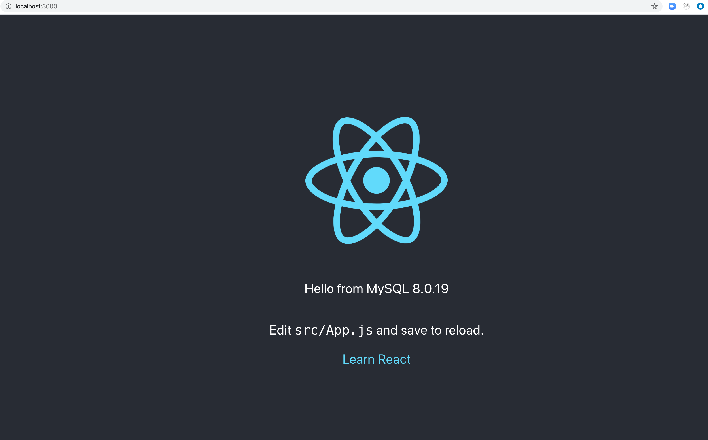

#  Production-Ready Full-Stack Containerization (React & Node.js)

This repository contains a highly secure, multi-stage Docker infrastructure engineered for a Full-Stack application (React frontend, Node.js/Express API, and MariaDB). The entire stack is fully containerized, decoupled, and optimized for both rapid local development and high-performance production deployments without modifying the core application source code.



---

##  Project Architecture Tree

Below is the repository structure highlighting the DevOps and Containerization configuration files:


.
├── backend/
│   ├── Dockerfile             
│   └── ...                    
├── frontend/
│   ├── Dockerfile            
│   └── ...                    
├── db/
│   └── password.txt            
├── compose.yaml               # Primary orchestration manifest (Development Grid)
├── docker-compose-prod.yaml   # Production orchestration cluster manifest
├── .env                        
├── output.png               
└── README.md                  


---

##  Infrastructure & DevOps Stack

*   **Orchestration & Deployment:** Docker, Docker Compose (Decoupled Dev/Prod configs)
*   **Container Security:** Docker Secrets (Dynamic credential injection)
*   **Network Architecture:** Bridge Networks with explicit public/private isolation
*   **Health Auditing:** Automated container health checks (`mysqladmin` & custom node probes)
*   **Target Applications:** React.js (Served via Nginx Alpine) & Node.js/Express

---

## 🐋 Docker Multi-Stage Architecture

The `Dockerfile` manifests utilize advanced multi-stage build patterns to isolate development dependencies, accelerate cache hits, and minimize production image footprints.

###  Backend API Service (`backend/Dockerfile`)
*   **Development Stage:** Pins Node LTS, executes `npm ci` for deterministic package replication, exposes remote debugging ports (`9229`, `9230`), and sets up a containerized `vscode` user profile for non-root security.
*   **Health Check Layer:** Integrates an automated structural polling routine via `healthcheck.js` running every 30 seconds to report state metrics back to the engine.

###  Frontend UI Service (`frontend/Dockerfile`)
*   **Development Stage:** Instantiates an isolated Node workspace running a local hot-reloading development server on port `3000`.
*   **Builder Stage:** Compiles the front-end application workspace down into immutable, hyper-optimized static production assets.
*   **Production Stage (Nginx Asset Server):** Spawns a hardened, minimalist `nginx:alpine` instance. It discards all compiler dependencies and pulls *only* the raw production assets from the builder stage, offering maximum request delivery speeds.

---

##  Orchestration Lifecycles (Docker Compose)

The deployment landscape is cleanly divided into two purpose-built runtime environment configurations:

###  Local Development Grid (`compose.yaml`)
Built to optimize developer velocity and enable transparent live testing:
*   **Bind Mount Hot-Reloading:** Maps local source directories (`src`) directly into the container. Code changes propagate instantly without structural image rebuilds, while maintaining an isolated, performance-optimized anonymous volume for runtime `node_modules`.
*   **Runtime Debug Bridges:** Opens debugging sockets out to the host workspace to attach active runtime debuggers seamlessly.

###  Production Environment Cluster (`docker-compose-prod.yaml`)
Built with absolute immutability, defensive sequencing, and self-healing configurations:
*   **Strict Service Sequencing:** Uses advanced condition checking (`service_healthy`). The Express API service will strictly defer its initialization until the underlying Database completes its warmup routines and passes its internal ping test.
*   **Self-Healing Policies:** Enforces `restart: always` and `unless-stopped` rules globally across the grid to ensure automatic container recovery.

---

##  Security Hardening & Network Isolation

*   **Docker Secrets (Credential Decentralization):** Database root passwords are completely extracted away from environment files or code strings. They are injected cryptographically at runtime via secure system pathways (`db/password.txt`), eliminating potential secret leaks.
*   **Strict Perimeter Isolation:** The infrastructure deploys two isolated virtual bridge networks:
    *   `public`: Connects external reverse proxies and user traffic safely into the UI and API gateways.
    *   `private`: A completely blind, inner network tier. It seals off the Database cluster (`MariaDB`) from the outside internet, restricting all TCP/IP traffic exclusively to internal API container requests.


### Prerequisites
1. Ensure [Docker Desktop / Engine](https://docker.com) is installed and running.
2. Initialize the local security file containing your DB root password at: `db/password.txt`.
3. Fill out the root infrastructure parameters inside your `.env` file as shown above.

### Spin Up the Development Sandbox
Run the command below to assemble images, mount source volumes, and keep active container log streams attached to your terminal screen:
```bash
docker-compose -f compose.yaml up --build
```

### Deploy the Production Cluster
Run the command below to execute the multi-stage Nginx builds and deploy the finalized, hardened system silently into the background:
```bash
docker-compose -f docker-compose-prod.yaml up --build -d
```
